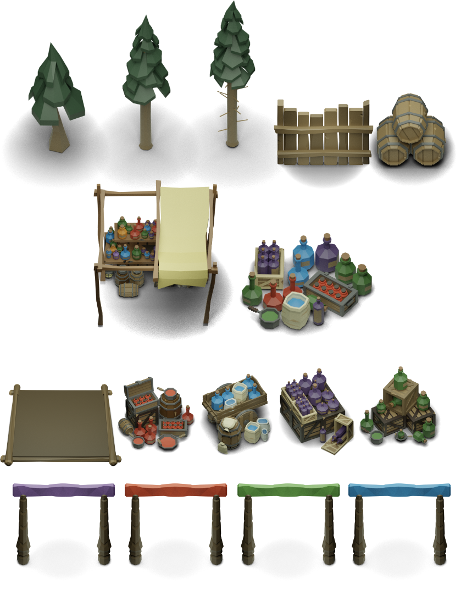

PaintBots - Gegenstände auf dem Feld
===

Oben siehst Du die Gegenstände, die auf dem Spielfeld stehen können. Je nach
Gegenstand wird der Spieler beeinflusst. Alle Gegenstände können in
unterschiedlichen Größen (Skalierungen) vorkommen.

1. 1. Es gibt 3 unterschiedliche Arten von Bäumen. Direkt unten am Stamm gibt es
   einen ellipsenförmigen Bereich, bei dem Du nicht entlang laufen oder malen
   kannst.
   2. Durch Zäune kannst Du nicht hindurch laufen.  Zäune gibt es in
   horizontaler under vertikaler Ausrichtung.
   3. Ein Stapel mit Fässern stellt ebenfalls ein Hindernis dar und kann nicht
   durchquert werden.
2. Am Farbstand können alle Spieler ihre Farbe auffüllen. Der linke Farbstand
   enthält in der Mitte einen Bereich durch den man nicht laufen. Außen herum
   kann die Farbe aufgefüllt werden. Die rechte Variante ist eine Ansammlung von
   Farben -- durch die kann man laufen und auch darauf malen. Der Bereich zum
   Auffüllen ist ein Quadruat, das fast über die gesamte Fläche geht.
3. Jeder Spieler hat eine individuelle Farbe. Für jede Farbe gibt es auch einen
   individuellen Farbstand. Die Bodenplatte ganz links markiert den Bereich, in
   dem die Farbe aufgefüllt werden kann. Die Bodenplatte kann nicht angemalt
   werden. Die Gegenstände daneben befinden sich jeweils auf der Bodenplatte und
   verhindern auch das Laufen.
4. Die Farbtore ganz unten lassen nur den Spieler mit der jeweiligen Farbe
   passieren -- alle anderen werden am Laufen gehindert. Die Tore gibt es auch
   in vertikaler Ausrichtung.
