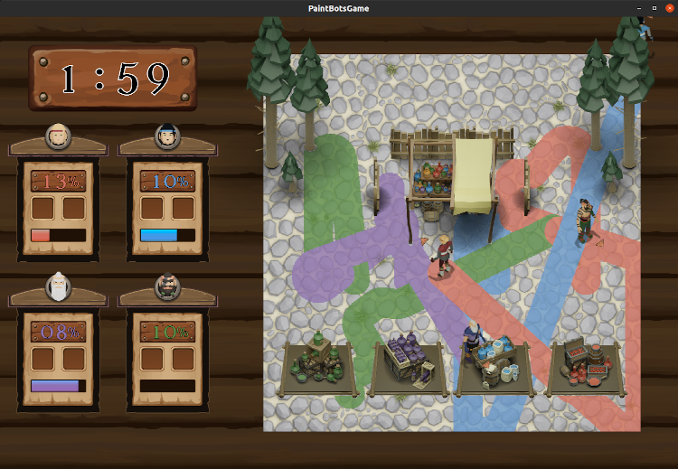
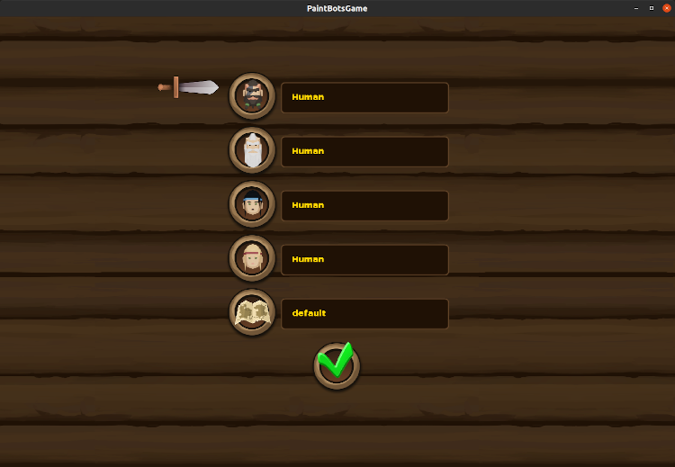

Paint Bots - Es geht los!
===

Das Einreichen bei dieser Aufgabe ist freiwillig. Es gibt keine wirkliche Aufgabe aber Du kannst uns Feedback schicken.
{: .p .information }

{:width="40%"}

**Paint Bots** ist ein lokales Multiplayer Spiel, das sich am Klassiker
**[Battle Painters]** orientiert. Bis zu vier Personen treten gegeneinander
an. Ziel ist es einen möglichst großen Teil der Spielfläche mit der eigenen
Farbe zu einzufärben.

[Battle Painters]: http://www.saitogames.com/battlepainters/

## Hintergrund[^note]

Im nordischen Firnstayn wird jedes Jahr zur Sommersonnenwende das
Midsommar-Fest abgehalten. Es ist nicht irgendein Fest, sondern es ist **das
!!11!(eins-eins-elf)** Fest. Eine gesamte Woche lang wird gefeiert, gesungen
gegessen und gespielt. Außerdem werden ständig irgendwelche Feuer abgebrannt.
Ein Höhepunkt der gesamten Festwoche ist der Wettkampf, der am 3. Tag
ausgefochten wird. Die Gewinnerin[^winner] wird die *rechte Hand* des
Jarls[^male] von Firnstayn. Diesen Titel behält sie bis zum nächsten
Midsommar-Fest. Früher wurde der Wettkampf ganz klassisch mit
Schere-Stein-Papier ausgetragen. In diesem Jahr wird die Siegerin[^winner]
jedoch anders bestimmt. Diesmal trifft sich das ganze Dorf auf dem zentralen
Thing-Platz. Dann fangen alle an den Platz mit Farbe zu bepinseln. Die Person,
die am Ende des Wettstreits die meiste Farbe verteilt hat, gewinnt und wird
die *rechte Hand* des Jarls. Außerdem darf sie sich bis zum nächsten Wettkampf
*"Heldin der Farben"* nennen.

[^note]: Wir erheben keinen Anspruch auf historische Korrektheit, wir denken uns
    das alles nur aus.

[^winner]: Manchmal gewinnt auch ein Mann.

[^male]: Paint Bots spielt im Jahr 3405 unserer Zeitrechnung. Da ist der Jarl
    von Firnstayn männlich; das erkennt man auch am Namen - *Gunnar
    Sigmundson*. In 5 Jahren ist er allerdings zu alt, dann wird seine Tochter
    Jarl - *Gishild Gunnarsdotir*.

## Ziel

- Bemale so viel Fläche mit deiner Farbe wie möglich.
- Wer nach abgelaufener Zeit die meiste Fläche bemalt hat, gewinnt.

## Spielregeln & Mechaniken

- Jede Spielerin verfügt über eine individuelle Farbe (grün, [lila], blau,
  orange).
- Die Menge der Farbe ist begrenzt.
- Beim Laufen wird der Boden mit der jeweiligen Farbe angepinselt.
- Beim Malen wird Farbe verbraucht:
  - Laufen auf eigenen Flächen benötigt keine Farbe.
  - Laufen auf unbemalten Flächen benötigt die einfache Menge.
  - Laufen auf andersfarbigen Flächen benötigt die doppelte Menge.
- Wenn sich zwei Spieler auf der gleichen Stelle befinden, dann malen sie wie
  die Verrückten die Fläche immer wieder an und verbrauchen ganz schnell ganz
  viel Farbe.[^Bug]
- Du kannst die Farbe an verschiedenen Stellen auffüllen. Dazu gibt es
  individuelle und gemeinschaftliche Farbstände. Das Auffüllen geht nicht plötzlich sonder dauert etwas.
- Verschiedene Gegenstände auf dem Feld blockieren das Laufen.

[^Bug]: Das war eigentlich erst ein Bug, ist aber jetzt ein Feature. Dadurch
    werden neue Taktiken möglich und langweilige Taktikten werden etwas
    ausgehebelt.

[lila]: https://www.lichtmikroskop.net/optik/violett-lila-unterschied.php

## Steuerung

Du kannst die Laufrichtung der Figuren ändern. Verwende dazu folgende Tasten:

- Spieler 1, grün: linker/rechter Cursor,
- Spieler 2, [lila]: A/D,
- Spieler 3, blau: N/M,
- Spieler 4, orange: NUM_PAD_4/NUM_PAD_6.

## Download & Versionen

Du hast zwei Möglichkeiten das Spiel herunter zu laden:

1. Du nutzt die vorkompilierte [aktuelle] Version
2. oder Du nutzt das [git-Repository].

Der Dateiname kodiert den Zeitpunkt des Compile-Vorgangs und enthält Monat und
Tag; z.B. wurde `paintbots_0.04.20.jar` am 20. April erstellt. Im Laufe der
nächsten Wochen werden wir das Spiel aktualisieren um:

- Bugs auszubessern,
- Cheating zu unterbinden,
- neue Spielelemente einzufügen[^features].

Dabei wird sich an den **grundlegenden** Spielmechaniken nichts mehr ändern -- laufen, malen, Farbe verlieren und auffüllen.

[aktuelle]: https://thomas-wilde.github.io/PaintBots/release/
[git-Repository]: https://github.com/Thomas-Wilde/PaintBots
[^features]: Ich möchte gerne noch ein paar Levels erstellen, neue Levelobjekte
    hinzufügen und PowerUps (z.B. schneller laufen, dicker malen, ...)
    einbauen. Mal sehen ob ich das noch schaffe.

## Starten des Spiels

Das Spiel befindet sich in einer vorkompilierten `jar-Datei`. Du kannst es von
der Kommandozeile mit dem Befehl `java -jar paintbots_0.xx.xx.jar` starten.
Wobei `xx.xx.` für die jeweilige Version steht. Das Spiel startet im
Fenstermodus. Es erscheint folgendes Menü, in dem Du die Kontrolle für die
Figuren und das Level einstellen kannst - nutze dazu die Cursor-Tasten. Im
Grundzustand gibt es keine Bots und nur ein Level. Mit der Auswahl des *grünen
Häkchens* und der Enter-Taste startet das Spiel.

{:width="40%"}

## Starten des Spiels unter Windows

Der Start unter Windows funktioniert genauso, wie oben beschrieben. Beim Start
werden ein paar Ordner erstellt (dazu später mehr). Bitte achte daher darauf,
dass Du die `jar-Datei` **nicht** unterhalb des Nutzerverzeichnis ablegst. Dazu
gehören sowas wie *Desktop, Eigene Dateien, Downloads* usw. Windows ist manchmal
etwas zickig mit den Zugriffsrechten und unterbindet unter Umständen das
Erstellen von Ordnern. Außerdem solltest Du Leerzeichen in den Ordnernamen
vermeiden.

## Java Versionen

**PaintBots** wird mit OpenJDK 13 kompiliert. Wir nutzen für das Spiel die
Spieleengine [libGDX]. Die ist aktuell nur bis Java Version 13 kompatibel. Wir
haben das Spielen/Starten von **PaintBots** allerdings erfolgreich mit
folgenden Java-Versionen unter Windows und Linux getestet:

- JDK 8,
- JDK 11,
- JDK 13,
- JDK 14,
- JDK 16,
- JDK 17.

Es sollte beim Start also eigentlich keine Probleme geben. Falls Du doch eine
Fehlermeldung bekommst, dann kopiere die `jar-Datei` erstmal in einen anderen
Ordner ohne Leerzeichen (siehe *Starten des Spiels unter Windows*). Falls es
dann immer noch Probleme gibt probiere eine andere Java Version aus. Dabei
solltest Du erstmal auf eine **ältere** Version umsteigen und **nicht die
neueste** nehmen. Falls es dann immer noch Probleme gibt frag' Deine
Kommilitonen. Falls es dann immer noch Probleme gibt, schreibt Thomas eine Mail.

[libGDX]: https://libgdx.com/

---

{::comment}
Auf dieser Seite könnt Ihr Euren Bot zum Programmierwettbewerb
einreichen.

Die Beschreibung zum Wettbewerb findet Ihr **[hier]**.

Die Einreichung über dieses System bringt einige Vorteile und
eine Einschränkung mit sich

{::comment}

## Vorteile

- Euer Bot wird sofort getestet, so dass Ihr seht ob er die
  Anforderungen für die **[Klausurzulassung]** erfüllt.
- Wir können Eure Einreichungen auf diese Weise sehr einfach sammeln,
  auf Plagiate prüfen und an *Dirk "Apo" Aporius* für den
  eigentlichen Wettbewerb -- die "Kür", wo Eure Bots gegeneinander
  antreten -- weiterreichen.

## Einschränkung

- Ihr müsst Euren Bot **in einer Datei** `MyBot.java` (und damit als
  Klasse `MyBot`) implementieren.
- Ihr könnt die Methode `public String getName()` überschreiben um den
  Namen Eures Bots auszugeben.

Bitte denkt daran den Abschnitt `@Student(author="N", matrikelnummer="M")` auszufüllen!
{: .p .important}

dabei stehen

- `N`für Deinen Namen
- `M` für Deine Matrikelnummer und

**Wir wünschen Euch viel Spaß & Erfolg!**

[hier]: /page/wettbewerb
[Klausurzulassung]: /page/public/admission
